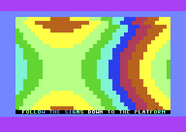

# Berlin Subway True SID Techno

Commodore 64 demo built around the same Berlin subway visual journey, with a focused true-SID techno implementation: gated pulse bass, style-dependent acid/lead voices, PWM movement, and saturated filter sweeps.

## Build and run

Requires ACME and VICE:

```sh
cd src
acme -f cbm -o ../build/berlin_subway_techno_sid.prg subway.s
x64sc -autostartprgmode 1 -autostart ../build/berlin_subway_techno_sid.prg
```

Build from `src/` so ACME resolves the bundled wireframe atlas files. The PRG is PAL-oriented and starts at `SYS 2061`.

## Sound design features

- Voice 1 uses explicit pulse-width modulation and real gated rests.
- Voice 2 changes waveform, ADSR, PWM, ring modulation, and sync by techno style.
- The filter LFO is style-dependent, cutoff-saturated, and uses the low cutoff bits for finer movement.
- The visual engine retains the 28-part station sequence, cards, scroller, raster IRQ, and atlas-backed wireframe.

See [docs/FUNCTIONS.md](docs/FUNCTIONS.md) for the code map and `docs/history/TRUE_TECHNO_SID_IMPLEMENTATION.md` for the supplied implementation notes.

## License

GPL-3.0-or-later. See [LICENSE](LICENSE).

## Live VICE capture


